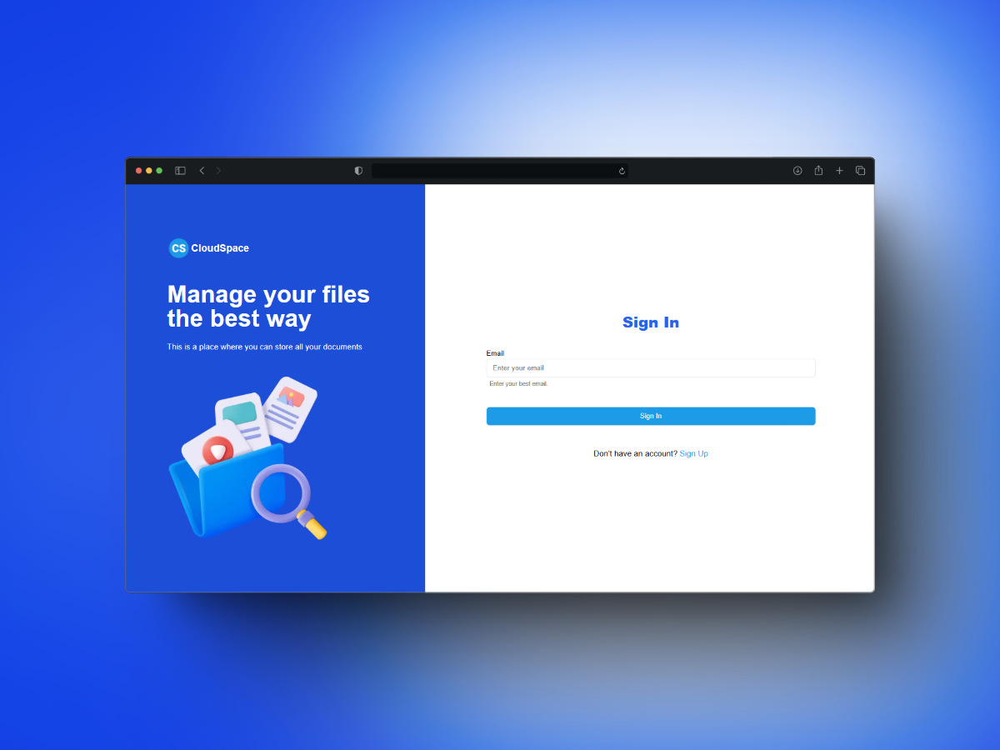
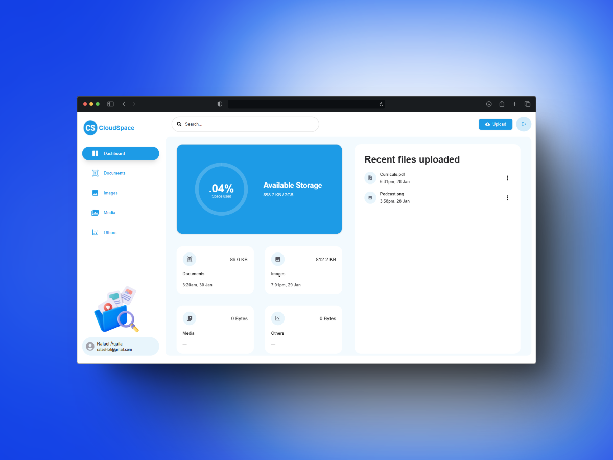

<p align="center">
   
   
</p>

<h1 align="center">
    <a href="#">CloudSpace</a>
</h1>

<p align="center">
    CloudSpace is a web application designed to assist with storage management, offering features such as storage control and client management.
</p>
<p align="center">
  <a href="https://github.com/rafael-bit/storage-management">
  	
  </a>
</p>

# 🚀 How It Works

Storage Management is a web application that simplifies storage administration, enabling efficient media.

## 👷 Running Locally

#### Clone the repository

```bash
git clone https://github.com/rafael-bit/storage-management
```

#### Install dependencies and run the application in development mode

```bash
yarn
yarn dev
```

Open this address in your browser: [storage Management](http://localhost:3000/)

# 💻 Technologies

- [Next.js](https://nextjs.org/)
- [Tailwind CSS](https://tailwindcss.com/)
- [Shadcn](https://ui.shadcn.com/)
- [Zod](https://zod.dev/)
- [Radix UI](https://www.radix-ui.com/)
- [Appwrite](https://appwrite.io/)

# 🚩 Bugs

Feel free to **report a new issue** with an appropriate title and description.

# 💡 Author

- Rafael Áquila ([@rafael-bit](https://github.com/rafael-bit))

# 🔧 Contributing

Check the [contribution page](https://github.com/rafael-bit/storage-management/) to see the best places to report issues, start discussions, and contribute.
